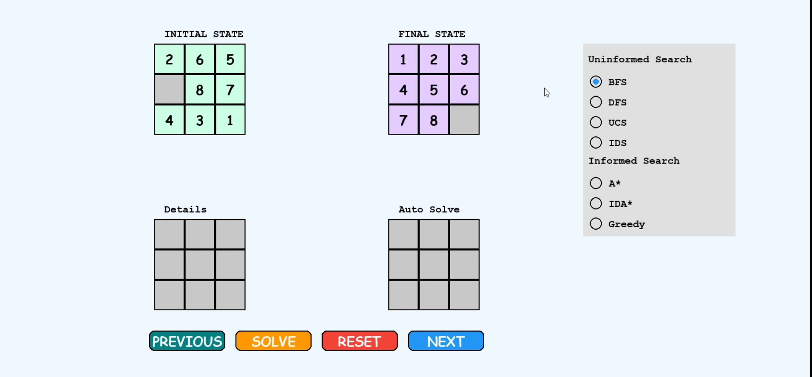
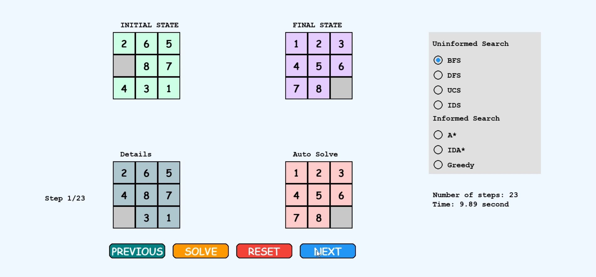

##  AI Puzzle Solver – Visualizing Search Algorithms in Action!

## 📌 Project Goal
This project is an **AI-driven puzzle solver** for the classic 8-puzzle problem, implemented with a visually appealing and interactive Pygame GUI. It enables users to select various AI search algorithms such as **A\*, BFS, DFS, UCS, IDA\*,IDS** and Greedy Search to solve the puzzle. The core focus of this project is to **demonstrate how AI algorithms can intelligently navigate state spaces** and visually show their decision-making process step-by-step.

 
  🔍 This is an Artificial Intelligence-focused project that blends search algorithm strategies with an intuitive interface to enhance understanding of AI search  techniques in action.

## 🛠️ Tech Stack & Tools Used
- **Language**: Python 3.10+
  
- **Libraries**:
  
  - **Pygame** – for GUI visualization

   - **NumPy** – matrix operations for board states

-  **AI Algorithms**:
  
  - **BFS** - Breadth-First Search
    
  - **DFS** - Depth-First Search
    
  - **UCS** - Uniform Cost Search
    
  - **IDS** - Iterative Deepening Search
    
  - **A\*** - A-Star Search (with Manhattan Distance Heuristic)
    
  - **IDA\*** - Iterative Deepening A*
    
  - **Greedy** - Greedy Best-First Search

## 🚀 Installation & Execution
  ### Prerequisites
  
  Make sure Python and pip are installed.
  
  ```bash
  python --version
  pip --version
  ```
  ### 1️⃣ **Clone the Repository**
  ```
  git clone https://github.com/Indhu-Vempatapu/PuzzleSolver-AI.git
  cd PuzzleSolver-AI
  ```
  ### 2️⃣ **Install Required Packages**
  ```
  pip install -r requirements.txt
  ```
  
  ### 3️⃣ **Set up Virtual Environment**
  ```
  python -m venv myenv
  ./myenv/Scripts/activate
  ```
  ### 4️⃣ **Run the Application**
  ```
  python main.py
  ```

## 🎥 Demo & Output
### 📹 Output Video

**Watch Demo Video**:

**

**Start State**: `[[2, 6, 5], [0, 8, 7], [4, 3, 1]]`

  

 **Goal State**: `[[1, 2, 3], [4, 5, 6], [7, 8, 0]]`

  

 


  
  
  


